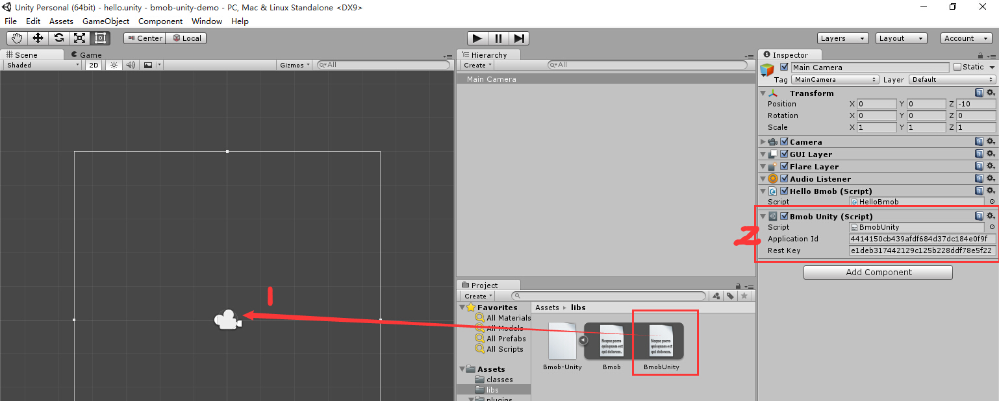
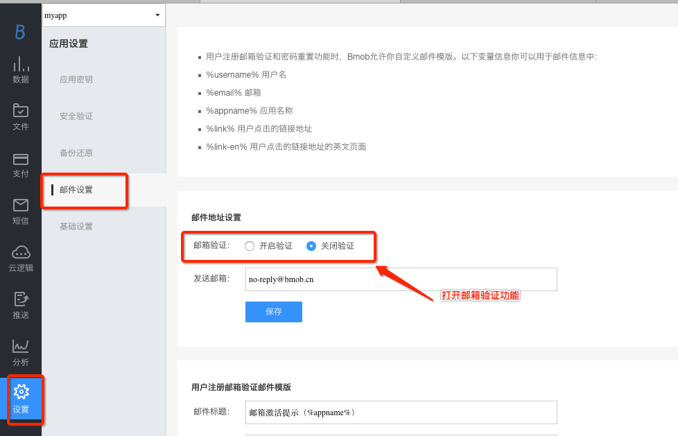
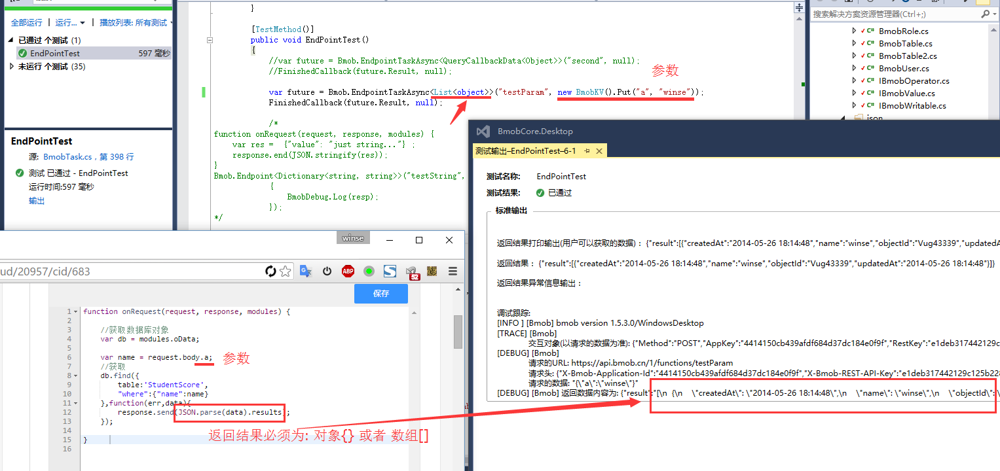
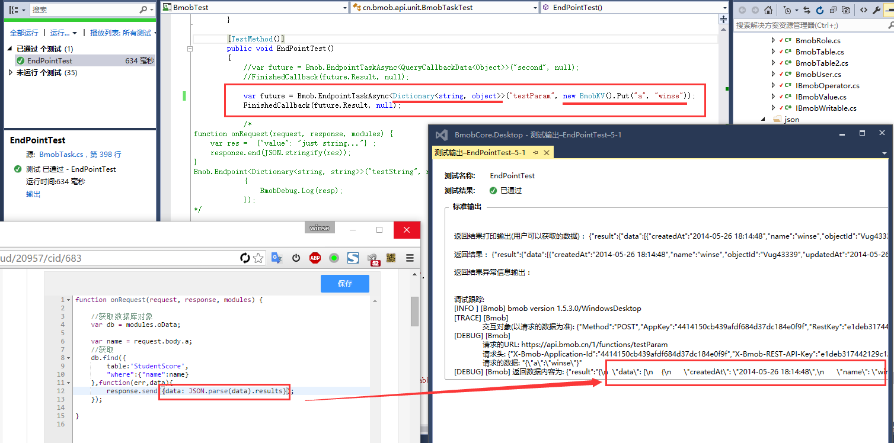

## 简介

Bmob平台为您的移动应用提供了一个完整的后端解决方案，我们提供轻量级的SDK开发包，让开发者以最小的配置和最简单的方式使用Bmob平台提供的服务，进而完全消除开发者编写服务器代码以及维护服务器的操作。

## 应用程序

在Bmob平台注册后，每个账户可创建多个应用程序，创建的每个应用程序都有其独自的应用程序ID，此后所有的应用程序将凭其ID进行Bmob SDK的使用。即使只有一个应用程序，也可以以不同的版本进行测试和生产。

## Bmob客户端初始化

### Unity

要使用Bmob提供的服务，首先需要把BmobUnity附加到你应用程序的Camara，然后获取BmobUnity脚本组件，才能进行下一步的操作。(把图中的Application Id换成你应用的appkey)



```
public class HelloBmob : MonoBehaviour
{
    //BmobUnity脚本组件实例
    private BmobUnity bmobUnity;

    // 初始化
    void Start()
    {
        //获取BmobUnity脚本组件
        bmobUnity = gameObject.GetComponent<BmobUnity>();
    }
```

### Deskstop

```
BmobWindows Bmob = new BmobWindows();
Bmob.initialize("4414150cb439afdf684d37dc184e0f9f", "e1deb317442129c125b228ddf78e5f22"); // 替换成你的appkey/RestKey
BmobDebug.Register(msg => { Debug.WriteLine(msg); }); // 用于调试输出请求参数
```

### Windowsphone

```
BmobWindowsPhone Bmob = new BmobWindowsPhone();
Bmob.initialize("4414150cb439afdf684d37dc184e0f9f", "e1deb317442129c125b228ddf78e5f22"); // 替换成你的appkey/RestKey
BmobDebug.Register(msg => { Debug.WriteLine(msg); }); // 用于调试输出请求参数
```

### Bmob接口方法

SDK组件目前提供了如下的方法供大家使用：

```
// 初始化组件（可供动态切换appKey、restKey）
public void initialize(string appKey, string restKey);

//////////////////////////////////////////////
//
// 数据处理
//
//////////////////////////////////////////////

public void Create(string tablename, IBmobWritable data, BmobCallback<cn.bmob.response.CreateCallbackData> callback);
public void Create<T>(T data, BmobCallback<cn.bmob.response.CreateCallbackData> callback) where T : BmobTable;
public void Delete(string tablename, string objectId, BmobCallback<cn.bmob.response.DeleteCallbackData> callback);
public void Delete<T>(T data, BmobCallback<cn.bmob.response.DeleteCallbackData> callback) where T : BmobTable;
public void Update(string tablename, string objectId, IBmobWritable data, BmobCallback<cn.bmob.response.UpdateCallbackData> callback);
public void Update<T>(T data, BmobCallback<cn.bmob.response.UpdateCallbackData> callback) where T : BmobTable;
public void Find<T>(string tablename, BmobQuery query, BmobCallback<cn.bmob.response.QueryCallbackData<T>> callback);
public void Get<T>(string tablename, string objectId, BmobCallback<T> callback);
public void Get<T>(T data, BmobCallback<T> callback) where T : BmobTable;

//////////////////////////////////////////////
//
// 用户处理
//
//////////////////////////////////////////////

// 用户注册
public void Signup(BmobUser user, BmobCallback<BmobUser> callback);
public void Signup<T>(T user, BmobCallback<T> callback) where T : BmobUser;
public void DeleteUser(string objectId, string sessionToken, BmobCallback<cn.bmob.response.DeleteCallbackData> callback);
public void DeleteUser<T>(T data, BmobCallback<cn.bmob.response.DeleteCallbackData> callback) where T : BmobUser;
public void UpdateUser(string objectId, BmobUser data, string sessionToken, BmobCallback<cn.bmob.response.UpdateCallbackData> callback);
public void UpdateUser<T>(T data, BmobCallback<cn.bmob.response.UpdateCallbackData> callback) where T : BmobUser;

// 发送邮箱验证
public void EmailVerify(string email, BmobCallback<cn.bmob.response.EmptyCallbackData> callback);

// 重置密码
public void Reset(string email, BmobCallback<cn.bmob.response.EmptyCallbackData> callback);

public void Login(string username, string pwd, BmobCallback<BmobUser> callback);
public void Login<T>(string username, string pwd, BmobCallback<T> callback) where T : BmobUser;

//////////////////////////////////////////////
//
// 其他功能
//
//////////////////////////////////////////////

// 调用云端代码
public void Endpoint<T>(string eMethod, BmobCallback<T> callback);
public void Endpoint<T>(string eMethod, IDictionary<string, object> parameters, BmobCallback<T> callback);

public void FileDelete(BmobFile file, BmobCallback<cn.bmob.response.EmptyCallbackData> callback);
public void FileDelete(string group, string url, BmobCallback<cn.bmob.response.EmptyCallbackData> callback);
public void FileUpload(BmobLocalFile file, BmobCallback<cn.bmob.response.UploadCallbackData> callback);
public void FileUpload(string localPath, BmobCallback<cn.bmob.response.UploadCallbackData> callback);

public void Endpoint<T>(string eMethod, BmobCallback<T> callback);
public void Endpoint<T>(string eMethod, IDictionary<string, object> parameters, BmobCallback<T> callback);

public void FileDelete(BmobFile file, BmobCallback<cn.bmob.response.EmptyCallbackData> callback);
public void FileDelete(string group, string url, BmobCallback<cn.bmob.response.EmptyCallbackData> callback);
public void FileUpload(BmobLocalFile file, BmobCallback<cn.bmob.response.UploadCallbackData> callback);
public void FileUpload(string localPath, BmobCallback<cn.bmob.response.UploadCallbackData> callback);

// 获取服务器时间戳
public void Timestamp(BmobCallback<cn.bmob.response.TimeStampCallbackData> callback);

public void Batch(BmobBatch requests, BmobCallback<List<Dictionary<string, object>>> callback);

public void Push(PushParamter param, BmobCallback<cn.bmob.response.EmptyCallbackData> callback);
public void Thumbnail(ThumbnailParameter param, BmobCallback<cn.bmob.response.ThumbnailCallbackData> callback);
```


针对C# 4.0+，SDK为每个接口对应添加了Task功能：

```
public Task<CreateCallbackData> CreateTaskAsync(string tablename, IBmobWritable data);
public Task<CreateCallbackData> CreateTaskAsync<T>(T data) where T : BmobTable;
public Task<UpdateCallbackData> UpdateTaskAsync(string tablename, string objectId, IBmobWritable data);
public Task<UpdateCallbackData> UpdateTaskAsync<T>(T data) where T : BmobTable;
public Task<DeleteCallbackData> DeleteTaskAsync(string tablename, string objectId);
public Task<DeleteCallbackData> DeleteTaskAsync<T>(T data) where T : BmobTable;
public Task<T> GetTaskAsync<T>(string tablename, string objectId);
public Task<T> GetTaskAsync<T>(T data) where T : BmobTable;
public Task<QueryCallbackData<T>> FindTaskAsync<T>(string tablename, BmobQuery query);

public Task<BmobUser> SignupTaskAsync(BmobUser user);
public Task<T> SignupTaskAsync<T>(T user) where T : BmobUser;
public Task<UpdateCallbackData> UpdateUserTaskAsync(string objectId, BmobUser data, string sessionToken);
public Task<UpdateCallbackData> UpdateUserTaskAsync<T>(T data) where T : BmobUser;
public Task<DeleteCallbackData> DeleteUserTaskAsync(string objectId, string sessionToken);
public Task<DeleteCallbackData> DeleteUserTaskAsync<T>(T data) where T : BmobUser;
public Task<EmptyCallbackData> EmailVerifyTaskAsync(string email);
public Task<EmptyCallbackData> PhoneVerifyTaskAsync(string phone);

public Task<EmptyCallbackData> ResetTaskAsync(string email);
public Task<EmptyCallbackData> ResetTaskAsync(string phone, string smsCode, string newPassword);

public Task<BmobUser> LoginTaskAsync(string username, string pwd);
public Task<T> LoginTaskAsync<T>(string username, string pwd) where T : BmobUser;

public Task<EmptyCallbackData> PushTaskAsync(PushParamter param);
public Task<TimeStampCallbackData> TimestampTaskAsync();

public Task<T> EndpointTaskAsync<T>(string eMethod);
public Task<T> EndpointTaskAsync<T>(string eMethod, IDictionary<string, object> parameters);

public Task<UploadCallbackData> FileUploadTaskAsync(BmobLocalFile file);
public Task<UploadCallbackData> FileUploadTaskAsync(string localPath);
public Task<EmptyCallbackData> FileDeleteTaskAsync(BmobFile file);
public Task<EmptyCallbackData> FileDeleteTaskAsync(string group, string url);

public Task<List<Dictionary<string, object>>> BatchTaskAsync(BmobBatch requests);
public Task<ThumbnailCallbackData> ThumbnailTaskAsync(ThumbnailParameter param);
```

关于接口方法的使用见详细开发文档。上面列表与实际可能有一点出错，可以查看最新版的源代码<https://github.com/bmob/BmobSharp>

## 数据类型

目前为止，我们支持的数据类型有String、int、Boolean、Array对象类型。同时Bmob也支持BmobDate、BmobGeoPoint、BmobFile数据类型。

### 对象

一个对象对应了数据表中的一条数据。C# SDK如果需要对数据进行操作，必须创建一个数据对象模型。


### 数据对象模型

Bmob的数据操作是建立在表基础上的，SDK封装了BmobTable来处理，所以任何要操作的数据对象推荐继承自BmobTable类。BmobTable对象包含objectId、createdAt、updatedAt、ACL四个默认的属性，objectId为对象的唯一标识，可以理解为数据表中的主键，createdAt为数据的创建时间，updatedAt为数据的最后修改时间，ACL为数据的操作权限。例如，游戏中可能会用到的分数对象GameScore,它可能包含score、playerName、cheatMode等属性，那么，对应的数据对象模型的示例代码如下：

```
public class GameScore : BmobTable 
{
	/// <summary>
	/// 玩家名称
	/// </summary>
	public string playerName { get; set; }

	/// <summary>
	/// 游戏分数
	/// </summary>
	public BmobInt score { get; set; }

	/// <summary>
	/// 是否作弊
	/// </summary>
	public BmobBoolean cheatMode { get; set; }

	public override void readFields(BmobInput input)
	{
		base.readFields(input);
		//读取属性值
		this.playerName = input.getString("playerName");
		this.score = input.getInt("score");
		this.cheatMode = input.getBoolean("cheatMode");
	}

	public override void write(BmobOutput output, bool all)
	{
		base.write(output, all);
		//写到发送端
		output.Put("playerName", this.playerName);
		output.Put("score", this.score);
		output.Put("cheatMode", this.cheatMode);
	}
}
```

### 特殊对象

为了提供更好的服务，BmobSDK中提供了BmobUser和BmobRole两个特殊的BmobTable对象来完成不同的功能，在这里我们统一称为特殊对象。

* BmobUser对象主要是针对应用中的用户功能而提供的，它对应着web端的User表，使用BmobUser对象可以很方便的在应用中实现用户的注册、登录、邮箱验证等功能，具体的使用方法可查看文档的用户部分。
* BmobRole对象主要用于角色管理中，它对应Web端的Role表。使用BmobRole对象可以方便的为不同的用户提供不同的角色控制权限。


## 添加数据

添加数据非常简单，任何BmobTable对象都具有Create方法可以用于将当前对象的内容保存到服务端。 例如，你现在要保存一条游戏分数的记录，可以这样做：

```
var data = new GameScore();
data.score = 25;
data.playerName = "bmob";
data.cheatMode = false;

bmobUnity.Create(TABLENAME, data, (resp, exception) =>
{
	if(exception != null){
		print("保存失败, 失败原因为： " + exception.Message);
		return;
	}

	print("保存成功, @" + resp.createdAt);
});
```

运行完以上代码后，数据即可保存到服务器端。为了确认数据是否真的已经保存成功，你可以在Bmob服务器端你应用程序的数据浏览项目中进行查看。你应该看到类似这样的结果：

```
objectId: "0c6db13c", score: 25, playerName: "bmob", cheatMode: false,createdAt:"2013-09-27 10:32:54", updatedAt:"2013-09-27 10:32:54"
```

这里需要注意几点：

* 在运行以上代码时，如果服务器端你创建的应用程序中已经存在GameScore数据表和相应的score、playerName、cheatMode字段，那么你此时添加的数据和数据类型也应该和服务器端的表结构一致，否则将保存数据失败。
* 如果服务器端不存在GameScore数据表，那么Bmob将根据你第一次(也就是运行的以上代码)保存的GameSocre对象在服务器为你创建此数据表并插入相应数据。
* 每个BmobTable对象都有几个默认的键(数据列)是不需要开发者指定的，objectId是每个保存成功数据的唯一标识符。createdAt和updatedAt代表每个对象(每条数据)在服务器上创建和最后修改的时间。ACL是数据的操作权限，这个在没有指定的情况下为空。这些键(数据列)的创建和数据内容是由服务器端自主来完成的。


## 查询数据


数据的查询可能是每个应用都会频繁使用到的，BmobUnity SDK提供了BmobQuery类，它提供了多样的方法来实现不同条件的查询，同时它的使用也是非常的简单和方便的。

### 查询所有数据

查询某个数据表中的所有数据是非常简单的查询操作，如查询玩家名字为“bmob”的所有数据的示例代码如下：

```
//创建一个BmobQuery查询对象
BmobQuery query = new BmobQuery();
//查询playerName的值为bmob的记录
query.WhereEqualTo("playerName", "bmob");
bmobUnity.Find<GameScore>(TABLENAME, query, (resp, exception) =>
{
	if (exception != null)
	{
		print("查询失败, 失败原因为： " + exception.Message);
		return;
	}

	//对返回结果进行处理
	List<GameScore> list = resp.results;
	foreach (var game in list)
	{
		print("获取的对象为： " + game.ToString());
	}
});
```

这里需要注意一点的是： 默认情况下，系统实际上并不会返回所有的数据，而是默认返回10条数据记录，你可以通过setLimit方法设置返回的记录数量。更多细节可点击查看分页查询一节。

### 查询单条数据

当我们知道某条数据的objectId时，就可以根据objectId直接获取单条数据对象。例如：查询objectId为68ee8131ca的人员信息。

```
bmobUnity.Get<GameScore>(TABLENAME, "68ee8131ca", (resp, exception) =>
{
	if (exception != null)
	{
		print("查询失败, 失败原因为： " + exception.Message);
		return;
	}

	GameScore game = resp;
	print("获取的对象为： " + game.ToString());
});
```

### 条件查询

上面我们已经看到了一个最简单的“字段值等于某个值”的简单条件的使用方法，BmobUnity为大家提供了更多的支持条件查询的方法。

如果需要查询playerName不等于“Barbie”的数据时可以使用WhereNotEqualTo的查询语法，示例代码如下：

```
query.WhereNotEqualTo("playerName", "Barbie");
```

你可以在你的查询操作中添加多个约束条件，来查询符合要求的数据：

```
query.WhereNotEqualTo("playerName", "Barbie");     //名字不等于Barbie
query.WhereGreaterThan("score", 60);      //分数大于60岁
```

你还可以使用一些比较查询，示例代码如下：

```
//分数 < 50
query.WhereLessThan("score", 50);
//分数 <= 50
query.WhereLessThanOrEqualTo("score", 50);
//分数 > 50
query.WhereGreaterThan("score", 50);
//分数 >= 50
query.WhereGreaterThanOrEqualTo("score", 50);
```

如果你想查询匹配几个不同值的数据，如：要查询“Barbie”,“Joe”,“Julia”三个人的成绩时，可以使用WhereContainedIn方法（查询“字段的值在指定集合中”的记录列表）来实现，示例代码如下：

```
query.WhereContainedIn("playerName", {"Barbie", "Joe", "Julia"});
//或者使用下面的语句
query.WhereContainedIn("playerName", "Barbie", "Joe", "Julia");
```

### 分页查询

在数据比较多的情况下，你往往需要显示加载一部分数据就可以了，这样可以节省用户的流量和提升数据加载速度，提高用户体验。这时候，我们使用Limit方法就可以限制查询结果的数据条数。默认情况下Limit的值为10，示例代码如下：

```
BmobQuery query = new BmobQuery();
//设置最多返回20条记录
query.Limit("20");
```

在Limit的基础上进行分页显示数据的一个比较合理的解决办法是：使用SKip方法，跳过前多少条数据。默认情况下Skip的值为10，示例代码如下：

```
BmobQuery query = new BmobQuery();
//忽略前20条数据
query.Skip(20);
```

### 结果排序

如果你想对游戏分数进行升序排序，示例代码可如下：

```
BmobQuery query = new BmobQuery();
query.OrderBy("score");
```

如果你想对游戏分数进行降序排序，示例代码可如下：

```
BmobQuery query = new BmobQuery();
query.OrderByDescending("score");
```

如果你想对两个或者以上的字段进行升序排序，如对score和cheatMode进行升序排序，示例代码如下：

```
BmobQuery query = new BmobQuery();
query.OrderBy("score").ThenBy("cheatMode");
```

如果你想对两个或者以上的字段进行降序排序，如对score和cheatMode进行降序排序，示例代码如下：

```
BmobQuery query = new BmobQuery();
query.OrderByDescending("score").ThenByDescending("cheatMode");
```

这些排序的方法还可以混合使用，具体详细用法不再详述。

### 统计对象数量

如果你想查询一个特定玩家玩的游戏场数，那么，示例代码可如下：

```
BmobQuery query = new BmobQuery();
query.WhereEqualTo("playerName", "bmob");
query.Count ();
bmobUnity.Find<GameScore>(TABLENAME, query, (resp, exception) =>
{
	if (exception != null)
	{
		print("查询失败, 失败原因为： " + exception.Message);
		return;
	}

	List<GameScore> list = resp.results;
	BmobInt count = resp.count;
	print("满足条件的对象个数为： " + count.Get());
	foreach (var game in list)
	{
		print("获取的对象为： " + game.ToString());
	}
});
```

### **或**查询

上面提到的查询语句都是and作为连接词的条件查询，但很多时候你还需要使用到“或（Or）”查询，如，你想查找GameScore表中 score 大于 90 或者 cheatMode 等于 true 的记录，示例代码如下：

```
BmobQuery q1 = new BmobQuery();
q1.WhereGreaterThan("score", 90);

BmobQuery q2 = new BmobQuery();
q2.WhereEqualTo("cheatMode", true);

//Or查询
q1 = q1.Or(q2);
```

Or查询是可变参数方法，你可以在里面放更多的查询对象，当然了，在Or查询方法里面的参数连接词为and。

### 查询指定列

有的时候，一张表的数据列比较多，而我们只想查询返回某些列的数据时，我们可以使用BmobQuery对象提供的Select方法来实现。如从GameScore表中查找playerName的值的示例代码如下：

```
BmobQuery query = new BmobQuery();
query.Select("playerName");
bmobUnity.Find<GameScore>(TABLENAME, query, (resp, exception) =>
{
	if (exception != null)
	{
		print("查询失败, 失败原因为： " + exception.Message);
		return;
	}

	List<GameScore> list = resp.results;
	foreach (var game in list)
	{
	}
});
```

指定多列时多次调用即可，如：

```
BmobQuery query = new BmobQuery();
query.Select("playerName", "score");
```

## 删除与修改数据

### 修改数据

更新一个对象也是非常简单。例如：将GameScore表中objectId为0c6db13c的游戏分数修改为77.

```
GameScore game = new GameScore();
game.score = 77;
bmobUnity.Update(TABLENAME, "68ee8131ca", game, (resp, exception) =>
{
	if (exception != null)
	{
		print("修改失败, 失败原因为： " + exception.Message);
		return;
	}

	print("修改成功, @" + resp.updatedAt);
 });
```

### 删除数据

从服务器删除对象。例如：将GameScore表中objectId为68ee8131ca的数据删除。

```
bmobUnity.Delete("GameScore", "68ee8131ca", (resp, exception) =>
{
	if (exception != null)
	{
		print("删除失败, 失败原因为： " + exception.Message);
		return;
	}

	print("删除成功, @" + resp.msg);
});
```

## 数据关联

### 关联数据的对象模型

数据可以和其他数据进行关联（使用BmobPointer关联类型），就像是传统数据库中的主外键关系一样，如：一条微博由一个用户发布，可以有多个用户评论，每条评论信息对应一个用户。这时候，微博表对应的对象模型就应该如下：

```
public class Weibo : BmobTable
{
	// 发布的微博
	public string message { get; set; }
	// 微博的作者
	public BmobPointer<BmobUser> user { get; set; }
	// 微博的图片地址
	public string pic;

	public override void readFields(BmobInput input)
	{
		base.readFields(input);

		this.message = input.getString("message");
		this.user = input.Get<BmobPointer<BmobUser>>("user");
		this.pic = input.getString("pic");
	}

	public override void write(BmobOutput output, Boolean all)
	{
		base.write(output, all);

		output.Put("message", this.message);
		output.Put("user", this.user);
		output.Put("pic", this.pic);
	}
}
```

评论表对应的对象模型就应该如下：

```
public class Comment : BmobTable
{
	// 用户的评论
	public string comment { get; set; }
	// 发布评论的用户
	public BmobPointer<BmobUser> user { get; set; }
	// 评论的微博
	public BmobPointer<Weibo> weibo { get; set; }

	public override void readFields(BmobInput input)
	{
		base.readFields(input);

		this.comment = input.getString("comment");
		this.user = input.Get<BmobPointer<BmobUser>>("user");
		this.weibo = input.Get<BmobPointer<Weibo>>("weibo");
	}

	public override void write(BmobOutput output, Boolean all)
	{
		base.write(output, all);

		output.Put("comment", this.comment);
		output.Put("user", this.user);
		output.Put("weibo", this.weibo);
	}
}
```

### 添加关联关系

保存带有关联关系的评论表的数据的方法和保存其他数据模型的方法一样，还是使用BmobUnity对象的Create方法，示例代码如下：

```
//获取当前登录用户信息
GameUser user = BmobUser.CurrentUser();
var comment = new Comment();
// 设定评论内容
comment.comment = "发布的评论信息";
// 设定评论人
comment.user = new BmobPointer<BmobUser>(user);
// 设定评论对应的微博
Weibo weibo = new Weibo();
weibo.objectId = "ZGwboItm";
comment.weibo = new BmobPointer<Weibo>(weibo);;    

bmobUnity.Create(TABLENAME, comment, (resp, exception) =>
{
	if (exception != null)
	{
		print("添加失败, 失败原因为： " + exception.Message);
		return;
	}

	print("添加成功, @" + resp.createAt);
});
```

### 修改关联对象

关联对象的修改和普通BmobTable对象的修改一样，只需设置要更新的属性值，然后调用Update方法即可。下面假设将objectId为ef8e6agg28的评论记录的作者修改为其他人(这里是直接把当前用户的objectId设置为ZGwboItm)。

```
GameUser user = BmobUser.CurrentUser();
user.objectId = "ZGwboItm";
Comment comment = new Comment();
// SDK中有添加隐式转换，会把GameUser对象转换成BmobPointer<GameUser>
comment.user = user;
bmobUnity.Update(TABLENAME, "ef8e6agg28", comment, (resp, exception) =>
{
	if (exception != null)
	{
		print("修改失败, 失败原因为： " + exception.Message);
		return;
	}

	print("修改成功, @" + resp.updatedAt);
});
```

### 查询关联对象

如果你想要查询当前用户发表的所有评论信息，可以跟其他查询一样使用WhereEqualTo，示例代码如下：

```
BmobQuery query = new BmobQuery();
//按发布时间降序排列
query.OrderByDescending("updatedAt");
//获取当前用户信息
GameUser user = BmobUser.CurrentUser();
//查询当前用户的所有评论
query.WhereEqualTo("user", new BmobPointer<BmobUser>(user));    
// or use
// query.WhereMatchesQuery("user", user);
bmobUnity.Find<Comment>(TABLENAME, query, (resp, exception) =>
{
	if (exception != null)
	{
		print("查询失败, 失败原因为： " + exception.Message);
		return;
	}

	//对返回结果进行处理
	List<Comment> commentList = resp.results;
	foreach (var comment in commentList)
	{
		print("获取的对象为： " + comment.ToString());
	}
});
```

如果你想要查询带有图片的微博的评论列表，即在Comment表中对Weibo表进行内部的查询，可以使用WhereMatchesQuery<T>方法(DOC:查询的对象中的某个列符合另一个指针值)进行内部查询：

```
Weibo wb = new Weibo();
// Weibo对象赋值（条件赋值）

BmobQuery query = new BmobQuery();
query.WhereMatchesQuery<Weibo>("pic", new BmobPointer<Weibo>(wb)); 
bmobUnity.Find<Comment>(TABLENAME, query, (resp, exception) =>
{
	if (exception != null)
	{
		print("查询失败, 失败原因为： " + exception.Message);
		return;
	}

	//对返回结果进行处理
	List<Comment> commentList = resp.results;
	foreach (var comment in commentList)
	{
		print("获取的对象为： " + comment.ToString());
	}
});
```

反之，不想匹配某个子查询，你可以使用WhereDoesNotMatchQuery方法。 比如为了查询不带图片的微博的评论列表，就可以将上面的示例代码中的WhereMatchesQuery方法替换为WhereDoesNotMatchQuery方法。

如果你想获取最新的10条评论，同时包含这些评论对应的微博，实现代码可以为如下：

```
BmobQuery query = new BmobQuery();
// 限制10条
query.Limit(10); 
//按创建时间排序
query.Order("createdAt"); 
//同时将对应的微博信息也查询出来
query.Include("weibo");
//执行查询
bmobUnity.Find<Comment>(TABLENAME, query, (resp, exception) =>
{
	if (exception != null)
	{
		print("查询失败, 失败原因为： " + exception.Message);
		return;
	}

	//对返回结果进行处理
	List<Comment> commentList = resp.results;
	foreach (var comment in commentList)
	{
		print("获取的对象为： " + comment.ToString());
	}
});
```

你可以使用`.`号（英语句号）操作符来并列获得 Include 中的内嵌的对象。比如，你同时想 Include 一个 Comment 的 weibo 和weibo的 user（微博发布者）对象，你可以这样做：

```
query.Include("weibo.user");
```

## 用户

用户是一个应用程序的核心。对于个人开发者来说，自己的应用程序积累到越多的用户，就会给自己带来越强的创作动力。因此Bmob提供了一个专门的用户类——BmobUser来自动处理用户账户管理所需的功能。

有了这个类，你就可以在你的应用程序中添加用户账户功能。

BmobUser是BmobTable的一个子类，它继承了BmobTable所有的方法，具有BmobTable相同的功能。不同的是，BmobUser增加了一些特定的关于用户账户管理相关的功能。

### 属性

BmobUser除了从BmobTable继承的属性外，还有几个特定的属性： 

* username: 用户的用户名（必需）。 
* password: 用户的密码（必需）。 
* email: 用户的电子邮件地址（可选）。

### 创建用户对象

创建用户对象如下：

```
BmobUser user = new BmobUser();
```

如果你需要扩展用户资料信息，如给用户表添加生命值life和攻击指数attack，那么需要创建一个新的用户类，继承自BmobUser。示例代码如下：

```
public class GameUser : BmobUser
{
	public BmobInt life { get; set; }
	public BmobInt attack { get; set; }

	public override void write(BmobOutput output, bool all)
	{
		base.write(output, all);

		output.Put("life", this.life);
		output.Put("attack", this.attack);
	}

	public override void readFields(BmobInput input)
	{
		base.readFields(input);

		this.life = input.getInt("life");
		this.attack = input.getInt("attack");
	}
}
```

### 注册用户

你的应用程序可能会要求用户注册。下面的代码是一个典型的注册过程：

```
BmobUser user = new BmobUser();
user.username = "bmob";
user.password = "123456";
//邮箱用于找回密码
user.email = "partnet@bmob.cn";
//如使用了GameUser表的话，以下注册语句需要更改为：bmobUnity.Signup<MyBmobUser>(user,(resp, exception) =>
bmobUnity.Signup(user,(resp, exception) =>
{
	if (exception != null)
	{
		print("注册失败, 失败原因为： " + exception.Message);
		return;
	}
	print("注册成功");
});
```

在注册过程中，服务器会对注册用户信息进行检查，以确保注册的用户名和电子邮件地址是独一无二的。此外，对于用户的密码，你可以在应用程序中进行相应的加密处理后提交。

如果注册不成功，你可以查看返回的错误对象。最有可能的情况是，用户名或电子邮件已经被另一个用户注册。这种情况你可以提示用户，要求他们尝试使用不同的用户名进行注册。

你也可以要求用户使用Email做为用户名注册，这样做的好处是，你在提交信息的时候可以将输入的“用户名“默认设置为用户的Email地址，以后在用户忘记密码的情况下可以使用Bmob提供重置密码功能。

这里需要注意一点的是，有些时候你可能需要在用户注册时发送一封验证邮件，以确认用户邮箱的真实性。这时，你只需要登录自己的应用管理后台，在应用设置->邮件设置（下图）中把“邮箱验证”功能打开，Bmob云后端就会在注册时自动发动一封验证给用户。

### 设置邮箱验证功能



### 登录用户

当用户注册成功后，您需要让他们以后能够用注册的用户名登录到他们的账户使用应用。要做到这一点，你可以使用BmobUser类的login方法。

```
bmobUnity.Login<GameUser>("bmob", "123456", (resp, exception) => 
{
	if (exception != null)
	{
		print("登录失败, 失败原因为： " + exception.Message);
		return;
	}

	print("登录成功, @" + resp.username + "(" + resp.life + ")$[" + resp.sessionToken + "]");
	print("登录成功, 当前用户对象Session： " + BmobUser.CurrentUser.sessionToken);
});
```

### 获取当前用户

登录之后，你可以通过如下示例代码获取当前登录用户的信息：

```
BmobUser buser = BmobUser.CurrentUser;
// 或者
GameUser user = BmobUser.CurrentUser as GameUser;
```

### 更新用户

很多情况下你可能需要修改用户信息，比如你的应用具备修改个人资料的功能，示例代码如下：

```
GameUser user = new GameUser();
user.attack = 1000;
//需要知道用户记录的objectId和sessionToken信息
bmobUnity.UpdateUser("objectid", user, "sessionToken", (resp, exception) =>
{
	if (updateException != null)
	{
		print("保存失败, 失败原因为： " + updateException.Message);
		return;
	}

	print("保存成功, @" + updateResp.updatedAt);
});
```

在更新用户信息时，如果用户邮箱有变更并且在管理后台打开了邮箱验证选项的话，Bmob云后端同样会自动发一封邮件验证信息给用户。

### 查询用户

查询用户和查询普通对象一样，只需指定BmobUser类即可，如下查询用户名为bmob的用户：

```
BmobQuery query = new BmobQuery();
query.WhereEqualTo("username", "bmob");
bmobUnity.Find<GameUser>(BmobUser.TABLE, query, (resp, exception) =>
{
	if (exception != null)
	{
		print("查询失败, 失败原因为： " + exception.Message);
		return;
	}

	List<GameUser> list = resp.results;
	foreach (var user in list)
	{
		print("获取的对象为： " + user.ToString());
	}
});
```

### 密码重置

一旦你引入了一个密码系统，那么肯定会有用户忘记密码的情况。对于这种情况，我们提供了一种方法，让用户安全地重置起密码。

重置密码的流程很简单，开发者只需要求用户输入注册的电子邮件地址即可，示例代码如下：

```
bmobUnity.Reset("support@bmob.cn", (resp, exception) =>
{
	if (exception != null)
	{
		print("重置密码请求失败, 失败原因为： " + exception.Message);
		return;
	}

	print("重置密码请求发送成功！");
});
```

密码重置流程如下：

* 用户输入他们的电子邮件，请求重置自己的密码。
* Bmob向他们的邮箱发送一封包含特殊的密码重置连接的电子邮件。
* 用户根据向导点击重置密码连接，打开一个特殊的Bmob页面，根据提示他们可以输入一个新的密码。
* 用户的密码已被重置为新输入的密码。

### 邮箱验证

设置邮件验证是一个可选的应用设置, 这样可以对已经确认过邮件的用户提供一部分保留的体验，邮件验证功能会在用户(User)对象中加入emailVerified字段, 当一个用户的邮件被新添加或者修改过的话，emailVerified会被默认设为false，如果应用设置中开启了邮箱认证功能，Bmob会对用户填写的邮箱发送一个链接, 这个链接可以把emailVerified设置为 true.

emailVerified 字段有 3 种状态可以考虑：

* true : 用户可以点击邮件中的链接通过Bmob来验证地址，一个用户永远不会在新创建这个值的时候显示emailVerified为true。
* false : 用户(User)对象最后一次被刷新的时候, 用户并没有确认过他的邮箱地址, 如果你看到emailVerified为false的话，你可以考虑刷新用户(User)对象。
* missing : 用户(User)对象已经被创建，但应用设置并没有开启邮件验证功能； 或者用户(User)对象没有email邮箱。

### 请求验证Email

发送给用户的邮箱验证邮件会在一周内失效，可以通过调用 EmailVerify 来强制重新发送：

```
bmobUnity.EmailVerify("support@bmob.cn", (resp, exception) => 
{
	if (exception != null)
	{
		print("邮箱验证请求失败, 失败原因为： " + exception.Message);
		return;
	}

	print("邮箱验证请求发送成功！");
});
```

## ACL和角色

数据安全是软件系统中最重要的组成部分，为了更好的保护应用数据的安全，Bmob在软件架构层面提供了应用层次、表层次、ACL（Access Control List：访问控制列表）、角色管理（Role）四种不同粒度的权限控制的方式，确保用户数据的安全（详细请查看Bmob数据与安全页面，了解Bmob如何保护数据安全）。

其中，最灵活的方法是通过ACL和角色，它的思路是每一条数据有一个用户和角色的列表，以及这些用户和角色拥有什么样的许可权限。

大多数应用程序需要对不同的数据进行灵活的访问和控制，这就可以使用Bmob提供的ACL模式来实现。例如：

* 对于私有数据，读写权限可以只局限于数据的所有者。
* 对于一个论坛，会员和版主有写的权限，一般的游客只有读的权限。
* 对于日志数据只有开发者才能够访问，ACL可以拒绝所有的访问权限。
* 属于一个被授权的用户或者开发者所创建的数据，可以有公共的读的权限，但是写入权限仅限于管理者角色。
* 一个用户发送给另外一个用户的消息，可以只给这些用户赋予读写的权限。
* 用Bmob SDK，你可以对这些数据设置一个默认的ACL，这样，即使黑客反编译了你的应用，获取到Application Key，也仍然无法操作和破坏你的用户数据，确保了用户数据的安全可靠。而作为开发者，当你需要对这些数据进行管理时，可以通过超级权限Key（Master Key）进行。

### 默认访问权限

在没有显示指定的情况下，每一个BmobTable中的ACL(列)属性的默认值是所有人可读可写的。在客户端想要修改这个权限设置，只需要简单调用BmobACL的ReadAccess方法和WriteAccess方法，如设置所有用户的读权限为true，写权限为false的示例代码如下：

```
BmobACL acl = new BmobACL();
acl.ReadAccess("*");
```

这里说明一点的是： `*`号表示所有用户。ACL列为空表示所有用户可读可写；在不为空的情况下，读或写空缺表示没有对应权限。

### 指定用户的访问权限

如果你想对发表的微博设定一个权限：发表微博的作者有修改和删除的权限，其他用户只有读的权限，那么，可用如下的示例代码：

```
//创建数据对象
Weibo weibo = new Weibo();
weibo.message = "论电影的七个元素";
//创建一个ACL对象
BmobACL acl = new BmobACL();    
//设置所有人可读
acl.ReadAccess("*");
//参数是用户的objectId，这里设置为当前用户可写    
acl.WriteAccess(BmobUser.CurrentUser().objectId);   
//设置这条数据的ACL信息
weibo.ACL = acl;    
bmobUnity.Create(TABLENAME, weibo, (resp, exception) =>
{
	if(exception != null){
		print("保存失败, 失败原因为： " + exception.Message);
		return;
	}

	print("保存成功, @" + resp.createdAt);
});
```

如果要设定只有微博的作者有读写权限，其他人都没有读写权限，那么，可用如下的示例代码：

```
//创建数据对象
Weibo weibo = new Weibo();
weibo.message = "论电影的七个元素";
//创建一个ACL对象
BmobACL acl = new BmobACL();    
//参数是用户的objectId，这里设置为当前用户可读
acl.ReadAccess(BmobUser.CurrentUser().objectId);
//参数是用户的objectId，这里设置为当前用户可写    
acl.WriteAccess(BmobUser.CurrentUser().objectId);   
//设置这条数据的ACL信息
weibo.ACL = acl;    
bmobUnity.Create(TABLENAME, weibo, (resp, exception) =>
{
	if(exception != null){
		print("保存失败, 失败原因为： " + exception.Message);
		return;
	}

	print("保存成功, @" + resp.createdAt);
});
```

### 角色管理

上面的指定用户访问权限虽然很方便，但是对于有些应用可能会有一定的局限性。比如一家公司的工资系统，员工和公司的出纳们只拥有工资的读权限，而公司的人事和老板才拥有全部的读写权限。要实现这种功能，你也可以通过设置每个用户的ACL权限来实现，如下：

```
//创建公司某用户的工资对象
WageInfo wageinfo = new WageInfo();
wageinfo.Wage = 100000;   

//这里创建四个用户对象，分别为老板、人事小张、出纳小谢和自己
BmobUser boss;
BmobUser hr_zhang;
BmobUser cashier_xie;
BmobUser me;

//创建ACL对象
BmobACL acl = new BmobACL();

//设置四个用户读的权限
acl.ReadAccess(boos.objectId);    
acl.ReadAccess(hr_zhang.objectId);
acl.ReadAccess(cashier_xie.objectId);
acl.ReadAccess(me.objectId);

//设置老板和人事小张对这个工资的写权限
acl.WriteAccess(boss.objectId);
acl.WriteAccess(hr_zhang.objectId);

//设置工资对象的ACL
wageinfo.ACL =acl;
bmobUnity.Create(TABLENAME, wageinfo, (resp, exception) =>
{
	if(exception != null){
		print("保存失败, 失败原因为： " + exception.Message);
		return;
	}

	print("保存成功, @" + resp.createdAt);
});
```

但是，一个公司的人事、出纳和员工不仅仅只有一个人，同时还会有离职、调换岗位以及新员工加入等问题存在。如果用上面的代码对公司的每个人进行一一设置的话是不现实的，既麻烦也很难维护。针对这个问题，我们可以利用BmobRole来解决。我们只需要对用户进行分类，每个分类赋予不同的权限。如下代码实现：

```
//这里创建四个用户对象指针，分别为老板、人事小张、出纳小谢和自己
// just for test
BmobPointer<BmobUser> boss = new BmobUser() { objectId = "1" };
BmobPointer<BmobUser> hr_zhang = new BmobUser() { objectId = "2" };
BmobPointer<BmobUser> hr_luo = new BmobUser() { objectId = "3" };
BmobPointer<BmobUser> cashier_xie = new BmobUser() { objectId = "4" };
BmobPointer<BmobUser> me = new BmobUser() { objectId = "5" };

{
	//创建HR和Cashier两个用户角色（这里为了举例BmobRole的使用，将这段代码写在这里，正常情况下放在员工管理界面会更合适）
	BmobRole hr = new BmobRole();
	hr.name = "HR";
	var users = new BmobRelation<BmobUser>();
	users.Add(hr_zhang);
	users.Add(hr_luo);

	//将hr_zhang和hr_luo归属到hr角色中
	hr.AddUsers(users);

	//保存到云端角色表中（web端可以查看Role表）
	var future = Bmob.CreateTaskAsync(hr);
	FinishedCallback(future.Result, null);
}

{
	BmobRole cashier = new BmobRole();
	cashier.name = "Cashier";
	var users = new BmobRelation<BmobUser>();
	users.Add(cashier_xie);

	//将cashier_xie归属到cashier角色中
	cashier.AddUsers(users);

	//保存到云端角色表中（web端可以查看Role表）
	var future = Bmob.CreateTaskAsync(cashier);
	FinishedCallback(future.Result, null);
}
```

根据Role设置ACL：

```
//创建公司某用户的工资对象
WageInfo wageinfo = new WageInfo();
wageinfo.Wage =100000;

//创建ACL对象
BmobACL acl = new BmobACL();
acl.setReadAccess(boos, true); // 假设老板只有一个, 设置读权限
acl.setReadAccess(me, true); // 给自己设置读权限
// 给hr角色设置读权限
acl.RoleReadAccess(hr.name);
// 给cashier角色设置读权限
acl.RoleReadAccess(cashier.name);

// 设置老板拥有写权限
acl.RoleWriteAccess(boss.name);
// 设置hr角色拥有写权限
acl.RoleWriteAccess(hr.name);

//设置工资对象的ACL
wageinfo.ACL = acl;
//添加数据
bmobUnity.Create(TABLENAME, wageinfo, null);
```

需要说明一点的是，Web端的Role表也具有ACL的列，你可以将角色管理的权限赋予某些用户。

## 地理位置

Bmob允许用户根据地球的经度和纬度坐标进行基于地理位置的信息查询，可以轻松实现查找出离当前用户最接近的信息或地点的功能。

### 创建地理位置对象

首先需要创建一个BmobGeoPoint对象。例如，创建一个北纬39.913768382429105度-东经116.39727786183357度的BmobGeoPoint对象：

```
BmobGeoPoint point = new BmobGeoPoint(39.913768382429105, 116.39727786183357);
```

### 查询地理位置信息

现在，你的数据表中有了一定的地理坐标对象的数据， 就可以使用BmobQuery对象的WhereNear方法来找出最接近某个点的信息，示例代码如下（假设Person表中有一个名为area的地理坐标类型的字段）：

```
BmobQuery query = new BmobQuery();
bmobQuery.WhereNear("area", new BmobGeoPoint(112.934755, 24.52065));
bmobQuery.Limit(10);    //获取最接近用户地点的10条数据
bmobUnity.Find<Person>("Person", bmobQuery, (resp, exception) =>
{
	if (exception != null)
	{
		print("查询失败, 失败原因为： " + exception.Message);
		return;
	}

	//对返回结果进行处理
	List<Person> list = resp.results;
	foreach (var p in list)
	{
		print("获取的对象为： " + p.ToString());
	}
});
```

要限制查询指定距离范围的数据可以使用WhereWithinDistance，即：

```
//(112.934755, 24.52065)坐标点10公里内
query.WhereWithinDistance("area", new BmobGeoPoint(112.934755, 24.52065), 10);
```

要查询一个矩形范围内的信息可以使用addWhereWithinGeoBox来实现：

```
BmobGeoPoint southwestOfSF = new BmobGeoPoint(116.10675, 39.711669);
BmobGeoPoint northeastOfSF = new BmobGeoPoint(116.627623, 40.143687);
BmobQuery query = new BmobQuery();
query.WhereWithinGeoBox("area", southwestOfSF, northeastOfSF);
bmobUnity.Find<Person>("Person", bmobQuery, (resp, exception) =>
{
	if (exception != null)
	{
		print("查询失败, 失败原因为： " + exception.Message);
		return;
	}

	//对返回结果进行处理
	List<Person> list = resp.results;
	foreach (var p in list)
	{
		 print("获取的对象为： " + p.ToString());
	}
});
```

注意事项 目前有几个需要注意的地方：

* 每个BmobTable数据对象中只能有一个BmobGeoPoint对象。
* 地理位置的点不能超过规定的范围。纬度的范围应该是在-90.0到90.0之间。经度的范围应该是在-180.0到180.0之间。如果您添加的经纬度超出了以上范围，将导致程序错误。

## 原子计数器

很多游戏可能会有计数器功能的需求，比如某个玩家的比赛总分score。Bmob提供了非常便捷的方式来保证原子性的修改某一记录（这条记录的objectId为28dd44a271）某字段的值。示例代码如下：

```
GameScore object = new GameScore();
object.Increment("score", 1000);
//28dd44a271为这条记录的objectId
bmobUnity.Update(TABLENAME, "28dd44a271", object, FinishedCallback);
```
## 文件

Bmob可以让你将文件存储到服务器中，常见的文件类型，如图像文件、影像文件、音乐文件和任何其他二进制数据，都可以直接上传到云端文件系统中，示例代码如下：

```
bmobUnity.FileUpload("C:/Intel/Logs/IntelGFXCoin.log", (resp, exception) =>
{
	if (exception != null)
	{
		print("上传失败, 失败原因为： " + exception.Message);
		return;
	}
	print("上传成功，返回数据： " + resp.ToString());
});
```

resp的返回值为UploadCallbackData对象：

```
// 文件名
public string filename { get; set; }
/// 文件组名
public string group { get; set; }
/// 相对于Bmob文件服务器的位置
public string url { get; set; }
/// 文件请求的地址
public string getPath()
```

这里需要说明一点的是：单个上传的文件大小不可超过10M。

* 与结合用户表实例

一些用户不知道上传的附件和其他表结合怎么使用。下面介绍实际的案例：上传用户的头像

对象类：

```
    public class GameUser : BmobUser
    {
        public BmobFile File{get; set;}

        public override void readFields(BmobInput input)
        {
            base.readFields(input);

            this.File = input.Get<BmobFile>("file");
        }

        public override void write(BmobOutput output, Boolean all)
        {
            base.write(output, all);

            output.Put("file", this.File);
        }

    }
```

上传图片，并把图片保存到新用户User记录：

```
	Byte[] data = null;
	using (var stream = File.OpenRead("C:/Users/winse/Desktop/1.png"))
	{
		data = stream.ReadAsBytes();
	}

	var ffuture = Bmob.FileUploadTaskAsync(new BmobLocalFile(data, "21.png"));
	
	GameUser user = new GameUser();
	user.email = "1324@qq.com";
	user.phone = "1234";
	user.username = "1234";
	user.password = "123";

	user.File = ffuture.Result;

	var future = Bmob.SignupTaskAsync(user);
	var signResponse = future.Result;
...
```

## 云端代码

云端代码的调用方法非常简单，如下为调用执行云端方法test的实现代码：

```
Bmob.Endpoint<Hashtable>("test", (resp, exception) => 
{
	if (exception != null)
	{
		print("调用失败, 失败原因为： " + exception.Message);
		return;
	}

	print("返回对象为： " + resp);
});
```

相关云端代码的编写方式，请参考云端代码开发文档。

C#调用云端代码的返回值为json字符串，即不能只返回一个单值的对象！

* 不正确的使用方式：

```
function onRequest(request, response, modules) {
response.end("just string...");
}              
```

* C#中正确的方式：

云端代码：

```
function onRequest(request, response, modules) {
    var res =  {"value": "just string..."} ;
    response.end(JSON.stringify(res));
}                         
```

C#调用代码：

```
[TestMethod()]
public void EndpointParamAndStringTest()
{
    var p = new Dictionary<String, Object>();

    var future = Bmob.EndpointTaskAsync<Object>("testString", p);
    FinishedCallback(future.Result, null);
}
```

* 带参数返回map和list的例子

```
[TestMethod()]
public void EndPointTest()
{
	//var future = Bmob.EndpointTaskAsync<QueryCallbackData<Object>>("second", null);
	//FinishedCallback(future.Result, null);

	var future = Bmob.EndpointTaskAsync<List<object>>("testParam", new BmobKV().Put("a", "winse"));
	FinishedCallback(future.Result, null);

--

function onRequest(request, response, modules) {
    
    //获取数据库对象 
    var db = modules.oData; 

    var name = request.body.a;
    //获取
    db.find({ 
        table:'StudentScore',
        "where":{"name":name}  
    },function(err,data){
        response.send(JSON.parse(data).results);
    }); 
    
}
```





## 获取服务器时间

在BmobWindows对象中提供了一个方法，用于获取服务器时间。

```
BmobWindows bmobWindows = new BmobWindows();
bmobWindows.Timestamp( (resp, exception) => 
{
	if (exception != null)
	{
		print("请求失败, 失败原因为： " + exception.Message);
		return;
	}
	//返回服务器时间（单位：秒）
	print("返回时间戳为： " + resp.timestamp); 
	print("返回格式化的日期为： " + resp.datetime); 
}
);
```

## 时间

BmobDate对应服务端的Date类型。以`yyyy-MM-dd HH:mm:ss`的格式进行传输。

SDK提供了DateTime到BmobDate的隐式转化，简化BmobDate的实例化。

例如，查询在某个时间段内新增的数据，由于一个字段涉及到两个条件，需要使用符合查询功能：

```
BmobDate start = new DateTime(2014, 10, 1);
BmobDate end = new DateTime(2015, 1, 1);

var startQuery = new BmobQuery();
startQuery.WhereGreaterThanOrEqualTo("createdAt", start);

var endQuery = new BmobQuery();
endQuery.WhereLessThan("createdAt", end);

var query = startQuery.And(endQuery);
query.Limit(0);
query.Count();

var future = Bmob.FindTaskAsync<Object>(TABLENAME, query);
// 处理结果
// var result = future.Result;

```

## FAQ

* 请求信息查看

在开发过程中，其实很多问题开发者自己多确认下就能解决问题。SDK提供了查看发送请求到服务端的开关，只需要注册一下调试信息的输出方法即可。

```
BmobDebug.Register(msg => { Debug.WriteLine(msg); });
BmobDebug.level = BmobDebug.Level.TRACE;
```

在输出窗口，可以查看每次请求的appkey、请求数据。

* 关于Task，以及Windowsphone开发UI线程问题

新版本的SDK针对每个原有接口增加了对应Task接口方法，方便异步调用。这样就没有必要每次都callback回调，如果调用是多个线性的请求，那么使用callback代码会很难理解。

如果是开发desktop的应用，还可以等待结果的返回，但是在手机端，系统不允许有长时间等待的，要么使用callback要么使用异步。

使用回调： 

```
        private void create_Click(object sender, RoutedEventArgs e)
        {
            BmobApi table = new BmobApi();
            table.name = "hello wp";
            Bmob.Create(TABLE_NAME, table, (resp, ex) =>
            {
                string status = "OK";
                if (ex != null)
                {
                    status = "ERROR";
                }

                Dispatcher.BeginInvoke(() =>
                               {
                                   updateStatus(create, status);
                               });
            });
        }
```

注意：在回调用如果需要更新UI，需要转到UI线程才行。

使用异步：

```
// async方式异步请求处理，非阻塞访问
        private async void uploadBtn_Click(object sender, EventArgs e)
        {
            formstatus.Text = "正在上传...";

            var Result = await Bmob.FileUploadTaskAsync(fileText.Text);
            FinishedCallback(Result, resultText);

            bmobFile = Result;

            enterDba.Enabled = true;
            formstatus.Text = "上传成功！";
        }
```


