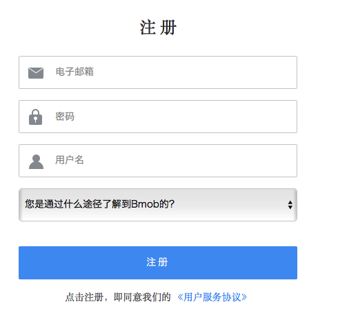
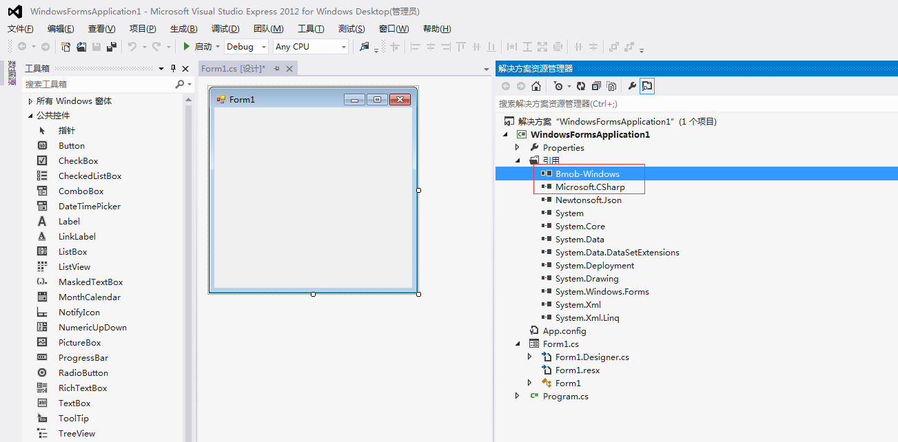
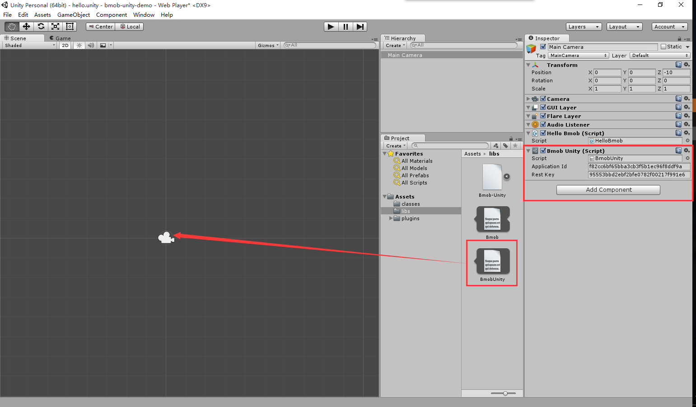

## 注册Bmob帐号

在网址栏输入 www.bmob.cn 或者在百度输入“Bmob后端云”进行搜索，打开Bmob官网后，点击右上角的“注册”，在跳转页面填入你的姓名、邮箱、设置密码，确认后到你的邮箱激活Bmob账户，你就可以用Bmob轻松开发应用了。

## 网站后台创建应用

登录账号进入bmob后台后，点击后台界面左上角“创建应用”，在弹出框输入你应用的名称，然后确认，你就拥有了一个等待开发的应用。



## 获取应用密钥

选择你要开发的应用，点击该应用下方对应的“应用密钥”


在跳转页面，获取`Application ID`和`REST API key`，此IDs将会在初始化SDK中使用到。


## 下载安装SDK

Bmob C# SDK下载地址：<https://github.com/bmob/BmobSharp/releases>

* Windows

下载后解压，将Windows文件夹下的`Bmob-Windows.dll`文件引用到你的项目工程中，如下图所示。



demo：[bmob-desktop-demo](https://github.com/bmob/bmob-demo-csharp/tree/master/examples/bmob-desktop-demo)

* Unity

下载后解压，将Unity文件夹下的`Bmob-Unity.dll`文件放置到你的项目工程的 **Assets/libs/** 目录下。

demo：[bmob-unity-demo](https://github.com/bmob/bmob-demo-csharp/tree/master/examples/bmob-unity-demo)
开发环境(调试)搭建：请查询[BmobSharp的README文档](https://github.com/bmob/BmobSharp#开发环境搭建)。

## 新建模型类

要想对Bmob云端的数据进行操作，需要创建和数据表对应的模型类。在Bmob中，模型类需要继承自`BmobTable`，类的实现如下。

```
//Game表对应的模型类
class GameObject : BmobTable
{

	private String fTable;
	//以下对应云端字段名称
	public BmobInt score { get; set; }
	public String playerName { get; set; }
	public BmobBoolean cheatMode { get; set; }

	//构造函数
	public GameObject() { }

	//构造函数
	public GameObject(String tableName)
	{
		this.fTable = tableName;
	}

	public override string table
	{
		get
		{
			if (fTable != null)
			{
				return fTable;
			}
			return base.table;
		}
	}

	//读字段信息
	public override void readFields(BmobInput input)
	{
		base.readFields(input);

		this.score = input.getInt("score");
		this.cheatMode = input.getBoolean("cheatMode");
		this.playerName = input.getString("playerName");
	}

	//写字段信息
	public override void write(BmobOutput output, bool all)
	{
		base.write(output, all);

		output.Put("score", this.score);
		output.Put("cheatMode", this.cheatMode);
		output.Put("playerName", this.playerName);
	}
}
```

## 初始化AppKey

* Windows

在正式对Bmob后端云进行操作之前，需要先初始化AppKey/RestKey信息，也就是初始化之前获取的`Application ID/RestKey`信息，实现代码如下。

```
        //创建Bmob实例
        private BmobWindows bmob;

        public BmobBaseForm()
            : base()
        {
            bmob = new BmobWindows();

            //初始化，这个ApplicationId/RestKey需要更改为你自己的ApplicationId/RestKey（ http://www.bmob.cn 上注册登录之后，创建应用可获取到ApplicationId/RestKey）
            Bmob.initialize("4414150cb439afdf684d37dc184e0f9f", "e1deb317442129c125b228ddf78e5f22");
            
            //注册调试工具
            BmobDebug.Register(msg => { Debug.WriteLine(msg); });
        }

        public BmobWindows Bmob
        {
            get { return bmob; }
        }
```

* Unity

选中摄像机，把BmobUnity对象拖拽到摄像机上，然后再Properties选项卡中设置 **ApplicationId** 和 **RestKey** 。



在脚本中启动方法中获取BmobUntiy：

```
		private static BmobUnity Bmob;

		// Use this for initialization
		void Start ()
		{
				BmobDebug.Register (print);
				BmobDebug.level = BmobDebug.Level.TRACE;
				Bmob = gameObject.GetComponent<BmobUnity> ();
		}
```

## 添加一行数据

初始化AppKey之后，我们就可以对Bmob云数据库进行操作了。下面以添加一行数据为例进行说明，实现代码如下:

```
//对应要操作的数据表
public const String TABLE_NAME = "Game";
//接下来要操作的数据的数据
private GameObject gameObject = new GameObject(TABLE_NAME);

private void createData_Click(object sender, EventArgs e)
{
	//设置值    
    System.Random rnd = new System.Random();
    gameObject.score = rnd.Next(-50, 170);
    gameObject.playerName = "123";
    gameObject.cheatMode = false;

    //保存数据
    var future = Bmob.CreateTaskAsync(gameObject);
	//异步显示返回的数据
    FinishedCallback(future.Result, resultText);
}
```

## 更多例子

大家可详细查看[示例源码](https://github.com/bmob/bmob-demo-csharp/tree/master/examples/bmob-desktop-demo/)和 [SDK项目源码](https://github.com/bmob/BmobSharp)，了解更多的Bmob C# SDK for Windows的操作。

