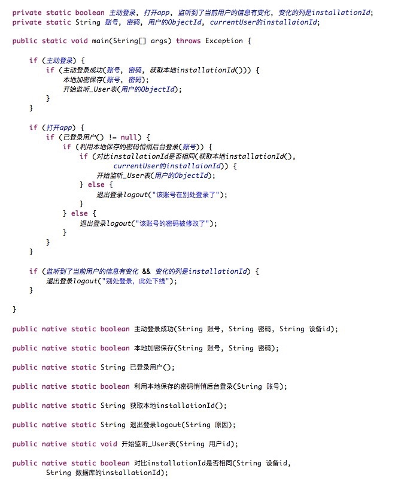

# 数据服务常见问题

Q: Bmob怎么设计赞和踩功能？ 
A: 利用原子计数器 
很多应用可能会有计数器功能的需求，比如文章点赞的功能，如果大量用户并发操作，用普通的更新方法操作的话，会存在数据不一致的情况。
详情请查看对应平台的原子计数器章节。

---

Q: 支持同步数据上传吗 
A: 不支持阻塞主线程同步上传数据的方法！

---

Q: SDK请求时占用内存大吗 
A: 如果只是数据服务的话，占用内存非常小。如果涉及图片服务，需要视图片大小而定内存占用情况。

---

Q: 文件能不能使用批量操作 
A: 当然可以。

---

Q: 查询单条数据的时候，只能通过objectId来查询么？  
A: 如果确定是只有一个的，条件查询也可以。

---

Q: 注册和登录的流程是怎样开发的 
A: 注册成功之后，服务器会返回`sessionToken`（标识用户登录成功的会话信息）给`BmobUser`对象，这时即可立即显示登录后台的界面，同步在后台调用登录接口进行登录操作。

---
Q: 登录踢人、改密码踢人相关 
A: 一处登录其他地方下线以及改密码的问题请看如下伪代码：

---

Q: Bmob数据库的pointer和我自己使用外建字段的区别？ 
A: pointer的好处是可以在查询的时候一并把关联的记录也查询下来，不需要二次查询。让查询的速度更快

---

